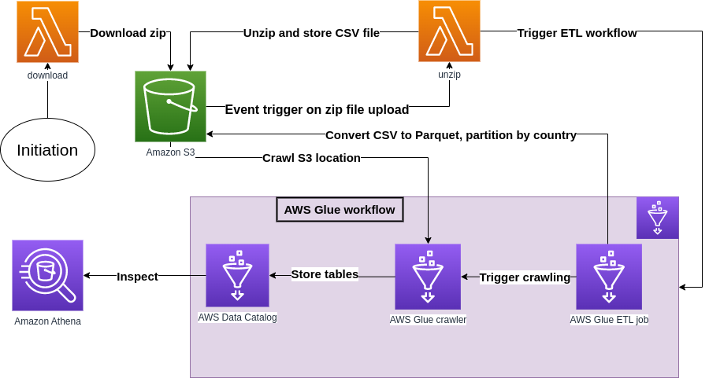

This is a homework project to design a ETL pipeline on AWS. Task specifications:
- The dataset in question is available here - https://eforexcel.com/wp/wp-content/uploads/2020/09/2m-Sales-Records.zip
- The solution should be a collection of Lambda functions working together to fetch the file from the https endpoint,
un-compress it, convert it to parquet, partition the data on S3 by the content of the Country field and define all
relevant resources to allow then the querying of the final dataset via Athena. Original file should be archived under
another prefix on the same bucket. The solution should be deployable via a CloudFormation template that
contains all the relevant AWS resources.

## Proposed solution

- **download_unzip_lambda**: This is a directory which includes lambda functions. Directory includes:
  - A common Dockerfile specification for lambda functions.
  - AWS lambda functions called __download.py__ and __unzip.py__ with different entrypoints.
- **glue**: This is a directory which includes a Python script called **glue_convert_partition.py** to specify AWS Glue ETL job on PySpark.
- **cloudformation**: This is a directory which includes scripts for deploying Cloudformation templates.
  - **cloudformation.yaml**: Initial Cloudformation template.
  - **cloudformation_s3_ecr.yaml**: Cloudformation template which includes codebase components (artifact S3, ECR) which will be used to create a change set on the stack.
  - **deploy_cloudformation.sh**: A end-to-end bash script to deploy cloudformation stack.