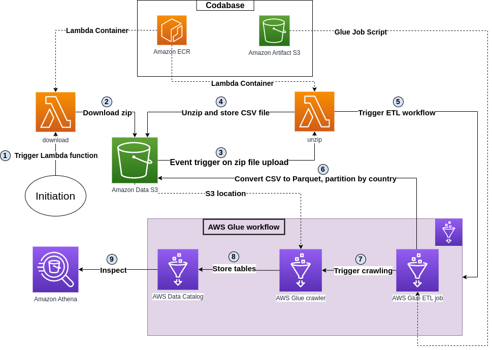

This is a homework project to design a ETL pipeline on AWS. Task specifications:
- The dataset in question is available here - https://eforexcel.com/wp/wp-content/uploads/2020/09/2m-Sales-Records.zip
- The solution should be a collection of Lambda functions working together to fetch the file from the https endpoint,
un-compress it, convert it to parquet, partition the data on S3 by the content of the Country field and define all
relevant resources to allow then the querying of the final dataset via Athena. Original file should be archived under
another prefix on the same bucket. The solution should be deployable via a CloudFormation template that
contains all the relevant AWS resources.

## Proposed solution

- **downloa_unzip**: This is a directory which includes a docker file spesification. Docker container will be used in common for two different AWS lambda functions called __download.py__ and __unzip.py__ with different entrypoints.
- **glue_convert_partition.py**: This is a Python script to specify AWS Glue ETL job on PySpark.